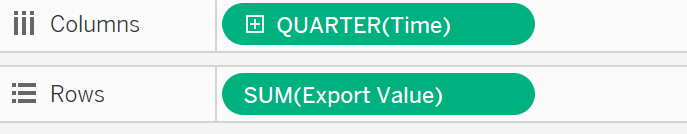
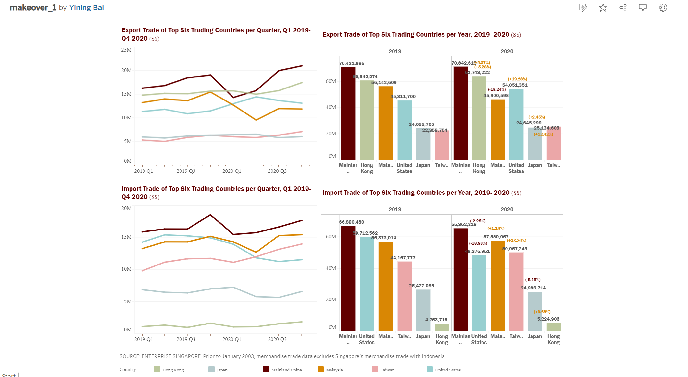

# 1). Original Visualization

# 2). Critiques and Suggestions for the Original Visualization

## 2.1 Critiques:

**Clarity:**

1.	In the same figure, the tick marks of import value and export value are not unified. For example, in the figure Hong Kong, the major tick marks interval of export value is set as 2M, however interval of import value is 200K. Actually, Hong Kong’s exports have always been much higher than its imports. The original graph does not accurately reflect the difference between the number of exports and the number of imports and misleads readers to believe that sometimes the number of imports exceeds the number of exports. 

2.	The tick marks of import value and export value are not unified in different figures. It is difficult for the readers to compare the differences between the imports and exports of different countries from the original graph. In fact, although the top trading countries in the world are selected here, the numbers vary considerably. The original graph gives the false impression that the differences between different countries are not obvious.

3.	The value range tick marks of axis are not unified in different figures. In some countries, the marks on the X-axis are 2019, 2020, and 2021, while in others, the mark on the X-axis is only 2020. Such graphs seem to indicate that different graphs reflect different periods of time. Meanwhile, the data shown here are for the period 2019-2020, and 2021 is a confusing marker on the X-axis.

4.	The sort of currency is not marked on the Y-axis. Therefore, readers cannot intuitively feel the size of the amount.

5.	The title on the X-axis is not accurate. The title is“Month of period”, but the pick mark is the year, which confuses the reader. In fact, the title here is not necessary.

6.	The source of the data is not identified at the bottom of the image, which is not standard. In addition, some special notes about the content of the data should also be added below the chart.

**Aesthetics:**

1.	Shading is added under lines in the original graph. In order to compare the difference between the imports and exports, the shading colors are set to translucent. But this design resulted in a third color where the import part and export part overlapped. The final presentation makes it difficult for the readers to distinguish between different areas. Shading is not necessary here.

2.	The widths of different graphs are not uniform. Such drawing is not standard. At the same time, different sizes may make readers confuse the length of time period for data analysis, and it is not conducive to comparing differences among different countries.

3.	Most of the broken lines are closer to the upper limit. Such design looks not comfortable and beautiful. It would be better if the lines are concentrated in the middle of the picture as much as possible.

## 2.2 Suggestions:

1.	Remove the scale line on the right side, and the lines of exports and imports can be all drawn with reference to the scale line on the left side. 

2.	Unify the range of values and scale lines in all the graphs.

3.	After rearranging the data, the six countries were plotted together, sharing the same X-axis and scale lines.

4.	Add the currency type name at the end of the picture title.

5.	Hide the X-axis title.

6.	Add text description of data source and value range in dashboards.

7.	The shading part is removed from the broken line diagram, and only the line segment part is retained.

8.	Adjust the maximum value of Y axis and scale line to ensure that most of the broken line chart is located in the center of the screen.

# 3).Proposed Design

# 4).Data visualization steps

## 4.1 Data Preparation

**1.	Remove unnecessary data.**
The original data contains a lot of data and information that we do not need, which can be removed altogether. Data for only these six countries, from January 2019 to December 2020, need to be retained. 

**2.	Rearrange the variables and columns.**
In order to import the data into Tableau for manipulation, the data needs to be rearranged and the corresponding variables need to be set.

{width=50%}

**3.	Import the date into Tableau.**
The excel sheet is imported into Tableau. 

{width=70%}

**4.	Change the data type.**
Change the data type of time from string type to date type.

{width=20%}

**5.	Create a new calculated field.**
In the comparison of trade volume, the balance of trade is a very important index which is often used to measure whether the trade and economic development of a country is healthy and stable. Here, we can use the formula to create a new variable based on the known import and export figures. The function “Create Calculated Field” under the analysis menu is used. 

{width=20%} 

{width=30%}

## 4.2 Create Charts

**Line Chart of Merchandise Trading of 6 countries**

1.	Create line chart. Set the columns and rows as the graph shown.

{width=40%}

{width=17%}

2.	Set the colors of import value and export value.

{width=10%}

3.	Set the scales and the range value of the Y-axis. Here the range is set as fixed, and the maximum value is 10M.

{width=30%}

4.	Change the title of the sheet as shown in the image, and select the appropriate color, font, and size. Also add the name of the currency type at the end.

{width=50%}

**Line Chart of Export/Import Trade per quarter**

1.	Create line chart. Set the columns and rows as the graph shown. This graph This graph shows quarterly changes, therefore the date should be set and retained as quarter form.

{width=40%}

2.	Set the color of the country lines as the graph shown.

{width=17%}

3.	Set the scales and the range value of the Y-axis. Here the range is set as fixed, and the maximum value is 25M.

4.	Change the title of the sheet as shown in the image, and select the appropriate color, font, and size. Also add the name of the currency type at the end.
{width=60%}

Then the line chart of import trade can be drawn with same steps.

**Bar Chart of Export/Import Trade per Year**

1.	Create bar chart.Set the columns and rows as the graph shown. Drag the country to the color mark and then set each country’s color accordingly.
{width=50%}

2.	Set the scales and the range value of the Y-axis. Here the range is set as fixed, and the maximum value is 70M.

3.	Click on the label in Marks menu and then select “Show mark labels”. Then specific statistics are added to the bar chart. After that, the text direction can be adjusted under the alignment menu.

{width=30%}

4.	Add annotation of the rate of change from 2019 to 2020 on the bar chart. Set the color of the annotation according to the positive or negative of the number.
{width=30%}

5.	Change the title of the sheet as shown in the image, and select the appropriate color, font, and size. Also add the name of the currency type at the end.  
{width=60%}

Then the bar chart of import trade can be drawn with same steps.

**Bar Chart of Balance of Trade**

1.	Create the bar chart and set the columns and rows as the graph shown. Here the created calculated field “Balance of Trade” created earlier is used. This graph shows the change of balance of trade of these six countries from 2019 to 2020.
{width=50%}

2.	Set the scales and the range value of the Y-axis. The maximum value is set as 60M and the minimum value is set as -20M.

3.	Drag the [SUM(Balance of Trade)] to the color mark and set the color according to the positive or negative of the number. Set the color steps as 2 and set the center value as 0.
{width=30%}

4.	Click on the label in Marks menu and then select “Show mark labels”. Adjust the text direction as before and select “Match Mark Color”. Then the mark labels’ color is same as the bar.
{width=20%}

5.	Add annotation of the rate of change from 2019 to 2020 on the bar chart. Set the color of the annotation according to the positive or negative of the number.

6.	Change the title of the sheet as shown in the image, and select the appropriate color, font, and size. Also add the name of the currency type at the end.  
{width=50%}

**Create the dashboard.**

Choose the sheet established before and add text notes to finish the dashboard.

# 5).	Final Visualization

## 5.1	Final Dashboard
{width=150%}
{width=150%}

## 5.2	Main Observations

*	According to the balance of trade calculation, Hong Kong has been in a trade surplus for a long time, with exports much higher than imports. The trade surplus is the largest among the six countries. From 2019 to 2020, Hong Kong's trade surplus still increased slightly.

*	Except Malaysia, the total export trade of the remaining five countries increased from 2019 to 2020. Malaysia's exports fell by about 18% from 2019. In addition, Malaysia's trade balance declined by the most among the six countries from 2019 to 2020, with a total decrease of 1500%, showing a relatively serious trade deficit. As a result, Malaysia's trade economy has become unbalanced, which the government needs to pay attention to.

*	The United States has the largest increase in its trade balance from 2019 to 2020, with a 139% increase, and moved from a trade deficit to a trade surplus in 2019. As a result, the health of the US trade economy improved from 2019 to 2020. At the same time, total US exports rose from 2019 to 2020, while total imports declined. Hence the decline in American foreign demand.

*	Taken as a whole, the total value of imports and exports in the six countries did not change very sharply in the eight quarters of the two years. Among them, from 2019 Q4 to 2020 Q2, the total export volume of China and Malaysia showed a relatively large decline and picked up from 2020 Q2 to 2020 Q3. Imports rose in almost six countries in March 2019 and then fell in the following quarter. This situation can be considered to be caused by the impact of the holiday at the end of the year and the beginning of the year.

