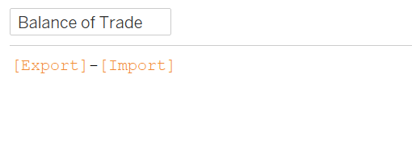
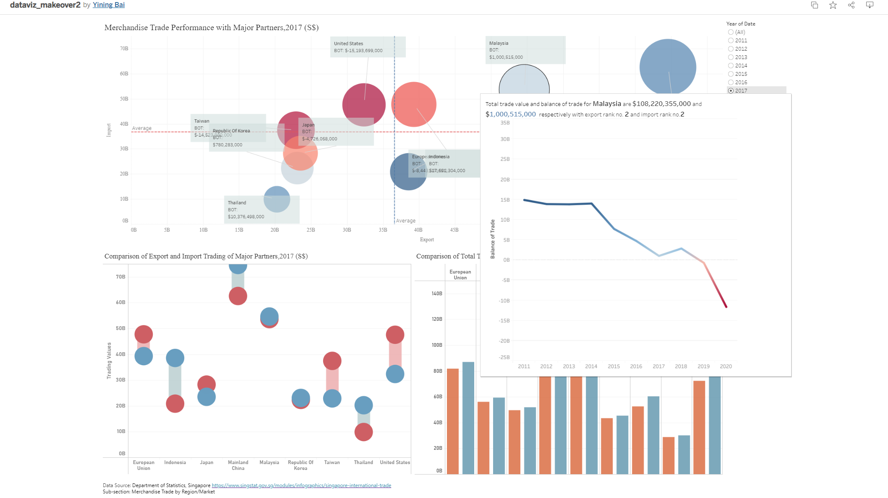

# 1). Original Visualization

# 2). Critiques and Suggestions for the Original Visualization

## 2.1 Critiques:

**Clarity:**

1.	The axes of the original chart all lacked corresponding currency units. In addition, the currency units are not included in the title, which prevents the reader from getting the correct sense of the size of the number and affects the accuracy and rigor of the chart.

2.	The original chart uses the size of the bubble to represent the total volume of trade for each country or region. However, by comparing the trading values indicated on the annotation with the bubble size on the graph, we can see that the original author does not use area to compare size, but radius. However, considering that the area of a circle is calculated by squaring the radius, the actual numerical differences will be magnified too much. This form of expression is not accurate, which will give readers wrong cognition of the comparison. China's trade volume, for example, is about four times as big as Thailand's, but it is much more than four times bigger on a graph.

3.	There is a lot more information in the original chart. In addition to the comparison of total trade and imports and exports, the raw chart also shows the balance of trade. The coordinate quadrant of original diagram is divided into two parts using color blocks. For the green part, the export volume of the green part is greater than the import volume of the trade, while the import volume of the blue part is greater than the export volume of the trade. According to the formula for the balance of trade: trade exports minus trade imports, the green part can be defined as net exporters and the blue part as net importers. But this form of presentation is actually confusing to the reader. Whether it is an importer, or an exporter depends on the position of the center of the circle. However, because the circle occupies a large area, it is easy to make the reader mistakenly think that the position of the whole circle determines the positive and negative trade balance.

**Aesthetics:**

1.	The original chart used different colors to represent different countries. In fact, this color is not necessary if the image contains a text indicating the name of the country. Also, using too many colors will make the focus of the diagram less obvious. In addition, the capacity for all colors is set to 100%, which causes many circles to overlap in occlusion.
2.	The background color block of the original diagram had nothing to do with the color of the circle, which made the overall design difficult to distinguish between net exporters and net exporters. And it is hard to compare the size of the balance of trade at a glance. The color of the circle should be changed to trade balance related.
3.	The original diagram is designed with labels, but labels cannot give the reader much detail. Because the original chart contains a lot of information, the Tooltip should be used to provide more detailed country or region related data. The overall graph can only provide a rough comparison for the reader, while the Tooltip should provide a very detailed and intuitive comparison of the data.

## 2.2 Suggestions:
1.	Add monetary units “S$” to the axes and titles.
2.	The size of different bubbles is changed to be defined by area instead of radius.
3.	No longer use country or region categories for color labelling. Fill the color of Bubble with the value of the trade balance. Use a red to blue gradient color. Red indicates net imports, and darker red indicates greater net imports. Blue represents net exporters, and the darker the blue, the greater the value of exports.
4.	Redesign the tooltips which should contain country/region name, import value, export value, total trade value and balance of trade. Besides that, the rankings of export and import should also be added to help to distinguish the comparisons among different countries or regions.

# 3).Proposed Design

# 4).Data visualization steps

## 4.1 Data Preparation

1. Data cleaning in the Excel.
The data can be downloaded from the DOS web page. We can get the import trading data and export trading data of Singapore with other trading partners. Firstly, we can extract the data of the nine major trading partners: EU, Mainland China, Japan, U.S., Indonesia, Malaysia, Republic of Korea, Thailand, and Taiwan. It is important to note here that the monetary units for these regions are not the same. The monetary unit for EU is million dollars, while others are thousand dollars. For uniform expression, all EU relevant values need to be multiplied by 1,000,000, while other values multiplied by 1,000. We can get the data as following graph shown.

To facilitate subsequent operations, the data should be reorganized. In the new worksheet, new columns “Date”, “Country/Region”, “Import”, and “Export” should be built up. We can use the transpose paste function to copy the selected data in the original sheet and paste them into the new sheet accordingly. Considering the need for data comparison of different years in subsequent analysis, 2 new columns “Import(last)” and “Export(last)” can be added. These two variables represent trade data for the same period of the previous year.

2. Import the data into Tableau.
Open the Tableau and add the file to the new data source. The finished sheet should be added in. 

3. Change the date type.
The data format of variable “Date” should be changed to date format.

{width=20%}

## 4.2 Create Charts

**Bubble chart of merchandise trade performance.**

We can draw a bubble chart to show the overall merchandise performance of the trading partners. 
1.	Create new calculated fields.
Firstly, two new calculated fields should be built through the function “Create new calculated field” under the analysis option. The formula is shown below. This new variable can help us recognize the overall trade volume.

{width=50%}

Then, another new variable “Balance of Trade” can be set up in the same way. Balance of trade if the difference between the value of a country’s imports and exports for a given period. Such index is usually used to measure the relative strength of a country’s economy.

{width=50%}

2.	Create bubble chart.
Drag [Export] and [Import] to the columns and rows panel separately.

{width=50%}

Drag [Country/Region] to the Detail. Drag [Total Trade Value] to the Size. Drag [Balance of Trade] to the Color. Change the marks setting from automatic to circle. 
{width=20%}
In the color panel, choose the red-blue diverging color and use full color range.

{width=50%}

Drag [Date] to the filter panel and choose years option.

{width=20%}

Click the filter option and choose show filter.

{width=25%}

3.	Axis setting.
Right click the axis and edit axis. The range of axis should be fixed and set the fixed start as 0 and fixed end as 75B.

{width=50%}

4.	Set the tooltip.
Given the complexity of the information contained in this image, we can set up a more detailed tooltip to help the reader understand it. Here four more new variables can be added to finish tooltips.

In addition to the numerical comparison of the coordinate axes, we also want to compare the size of import trade volume and export trade volume in a more intuitive way. Ranking variable can be used to realize it. We can create the ranking of import or export according to the formulas shown below.

{width=50%}

{width=50%}

According to the definition, if the result of balance of trade is positive, which means export value is higher than import value, such country can be considered as net exporter. Here we create two new variables as shown below to represent. 

{width=50%}

{width=50%}

Drag [Net Exporter] [Net Importer] [Ranking by Export] [Ranking by Import] to tooltip. 

{width=20%}

Click on the ranking by export and choose to compute using by country/region. The computation of ranking by import can also be modified in the same way. 

{width=20%}

Then edit the tooltip content according to the graph shown below.

{width=50%}

5.	Add reference lines.
Right click the y-axis and choose to add reference line. Modify the setting as the graph shown below. Then add the reference line of average export value in the same way.

{width=30%}

6.	Title setting
Set the title as the graph shown below.

{width=50%}

**Line chart of balance of trade of major trading partners**

We can draw a line chart to show the changes of balance of trade of different countries or regions from 2011 to 2020. This line chart should be added into the tooltip of the bubble chart we have created before, which can help the readers to understand the trend of balance of trade.

1.	Create line chart.
Drag [Balance of Trade] to the rows panel.  Drag [Date] to the columns panel and choose the date format as “years” and “discrete”. Drag [Country/Region] to the filters panel. The graph is shown below.

{width=50%}

Then drag [Balance of Trade] to the color and click on the color panel to choose the colors. 

{width=50%}

2.	Axis setting.
Right click the axis and edit axis. The range of axis should be fixed and set the fixed start as -25B and fixed end as 35B.

{width=50%}

3.	Title setting
Set the title  as the graph shown below.

{width=50%}

4.	Add the sheet to the tooltip of bubble chart.
Modify the tooltip of bubble chart created before according to the graph shown below.

{width=50%}

**Chart of  comparison of import and export values**

1.	Create the chart.
Firstly, create measure values including export value and import value.

{width=20%}

Drag the measures values to the columns panel and then drag the variable import to the columns panel as the second measurement. Drag [Country/Region] to the rows panel.

{width=50%}

Under the marks panel, choose the page of [SUM(Import)]. Change the graph format as gantt bar. Drag [Balance of Trade] to color and size. 

{width=20%}

Click on the color option and edit the colors. Here we choose the customized diverging colors. Then set the color steps as 2. 

{width=20%}

Under the marks panel, choose the page of [Measure Values]. Change the graph format as circle. Click on the color option and edit the colors. Here we choose the customized colors.
Right click the y-axis and choose to synchronize axis.

{width=20%}

Drag [Date] to the filter panel and choose years option.

Click the filter option and choose show filter. 
In the filter panel, click the triangle and choose the choice format as single value list.

2.	Axis setting.
Right click the axis and edit axis. The range of axis should be fixed and set the fixed start as 0 and fixed end as 75B.

{width=50%}

Change the axis title.

{width=50%}

Right click the axis and edit the format. Change the font size and font color as the graph shown below.

{width=20%}

3.	Title setting.
Set the title  as the graph shown below.

{width=50%}

**Bar Chart of total trade value comparing to the last period**

This chart will show the comparison of total trade value during one specific period and total trade value during the last period. Such chart can reflect the change of total merchandise volume year by year clearly.

1.	Create new field.
Here we need a new variable of total trade value during the last period. Create calculated field is used set up new variable. The formula is shown below.

{width=50%}

2.	Create the bar chart.
Drag [Country/Region] to the columns panel. Drag [Total Trade Value] and [Total Trade(last)] to the rows panel. These two variables should use the same y-axis. Then click on the show me panel and choose the side-by-side bar format.

{width=50%}

{width=20%}

Drag the measure names to color and then click the color panel and choose the customized colors.

{width=50%}

Drag [Date] to the filter panel and choose years option.

{width=20%}

3.	Axis setting.
Right click the axis and edit axis. The range of axis should be fixed and set the fixed start as 0 and fixed end as 150B.

{width=50%}

Then change the font size and the color of axis under the format panel. 

{width=20%}

4.	 Title setting.
Set the title  as the graph shown below.

{width=50%}

**Create the dashboard.**

Choose the sheet established before and add text notes to finish the dashboard.

# 5).	Final Visualization

## 5.1	Final Dashboard

## 5.2	Main Observations

* Overall situation:

From 2011 to 2016, Singapore's top three import source markets have been Mainland China, Indonesia, and Malaysia. In 2017, the EU surpassed Indonesia to become the third largest source market for Singapore's imports. Exports from the US to Singapore rose from 2019 to 2020, making it the third largest source market for Singapore's imports.
From 2011 to 2019, Singapore's top two export markets have been Mainland China and Malaysia. In addition, the United States and the European Union closely follow these two markets, and the difference in exports between the two markets is not significant.
In 2020, Taiwan's import volume to Singapore has increased significantly, making it the third largest export market of Singapore. The following is a detailed analysis of some important trading partners and important time nodes of Singapore.

* Mainland China:

In 2013, mainland China overtook Malaysia and became the largest trading partner of Singapore and maintained this position from 2013 to 2020. This can be found through the comparison of Bubble Chart in different years. China's bubble area has always been the largest since 2013, that is to say, the total trade volume between Singapore and China is the highest among all Singapore's trading partners. And since 2014, China's imports and exports to Singapore have consistently ranked first among all its trading partners. That is to say, China's trade has a significant impact on Singapore's economy.
In addition, China's trade balance with Singapore has been in surplus since 2011. The lowest point in the decade was in 2018, when China's trade balance with Singapore stood at S$1,003,882,000.

* United States:

From 2011 to 2019, the United States has consistently shown a trade balance deficit with Singapore, meaning that the United States imports less from the Singapore market than the United States exports to the Singapore market. That officially changed in 2020, when the U.S. trade balance with Singapore turned into a surplus for the first time in a decade. In fact, according to the trade balance line chart, the balance of trade between the United States and Singapore shows an upward trend, with a large increase from 2014 to 2016. In addition, from 2018 to 2020, US exports to Singapore saw a relatively large increase, and from 2018 to 2019, US imports to Singapore saw a relatively large increase.

* Malaysia:

Malaysia's trade balance with Singapore has been declining for ten years, and the trade surplus has gradually turned into trade deficit. In 2019, Malaysia's trade balance with Singapore turned negative for the first time at S$-730,405,000. And it continued to decline in 2020 with the largest decrease in this decade. This phenomenon can be speculated as a result of the economic downturn caused by COVID-19 sweeping the world.
Although China has replaced Malaysia as Singapore's largest trading partner since 2013, the total volume of trade between Malaysia and Singapore remains in the top three of Singapore's overall trading partners. For geographical and historical reasons, Malaysia still has an important influence on Singapore's trading economy. The continuous decline of Malaysia's trade balance also reflects the economic development trend and the change of development focus of Malaysia to a certain extent.

